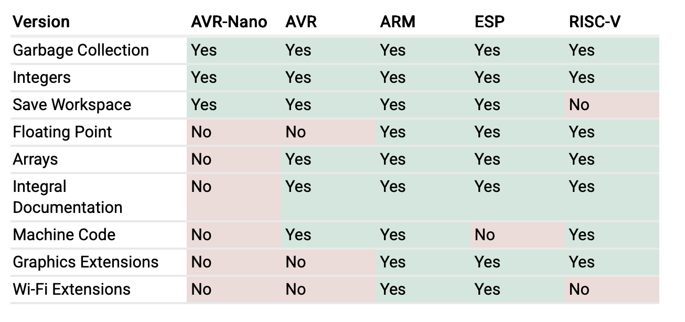

% uLisp Embedded Lisp
% Ray Rischpater, KF6GPE | kf6gpe@lothlorien.com | kf6gpe.org
% BALISP, 23 August 2025

# Introducing uLisp 
* Lisp explicitly written for embedded devices
    * Arduino, Adafruit M0/M4, Micro:bit, ESP32, RISC-V, Teensy
    * Runs on 8 bit, 16 bit, & 32 bit processors
    * Written as an Arduio Sketch, port to C in process
* Open-source under an MIT License

# Language features
* Mark-and-sweep garbage collection
* Strings
* Integers
* Floating point if supported by CPU
* Symbols
* Arrays
* Tail call optimization
* But *no* macros (boo!)

# Development features
* Simple program editor on devices with keyboard & screen
* Function tracing
* Pretty printer
* Integrated documentation
* Image persistence (`load-image`, `save-image`)

# Hardware features

These depend on the hardware target.

* Graphics (TFT, OLED, LED)
* SD Card / filesystem
* I2C
* SPI
* uLisp sensor library extensions
* WiFi extensions

# Target feature support

# References
* [uLisp Home Page](http://ulisp.com)
* [uLisp Sensor Library](http://library.ulisp.com)
